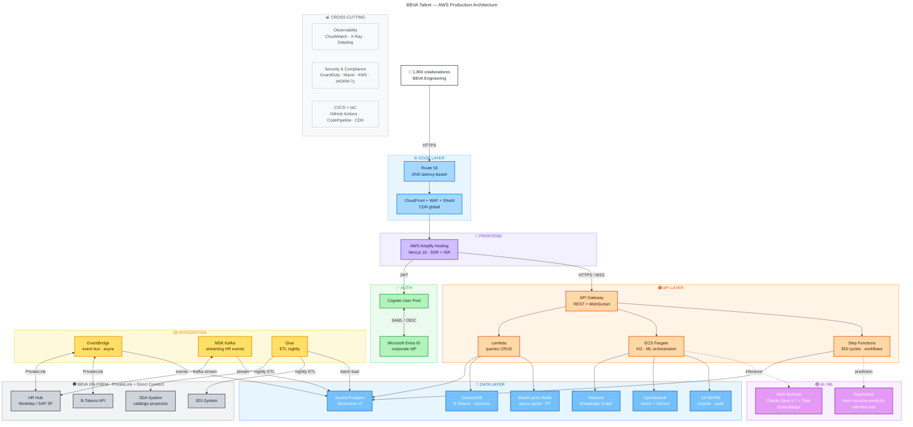

# BBVA Talent — Diagrama de arquitectura AWS

Versión Mermaid del diagrama de producción descrito en [`AWS_ARCHITECTURE.md`](./AWS_ARCHITECTURE.md). GitHub, GitLab, VS Code (con extensión Markdown Mermaid) y MkDocs renderizan este bloque automáticamente.

Para abrirlo en un editor interactivo: [mermaid.live](https://mermaid.live/) → pegar el contenido de [`aws-architecture-diagram.mmd`](./aws-architecture-diagram.mmd).

---



---

## Cómo leer el diagrama

| Color | Capa | Responsabilidad |
|-------|------|-----------------|
| 🌐 Azul claro | **Edge** | DNS, CDN, protección DDoS/WAF |
| 💜 Morado | **Frontend** | Next.js SSR/ISR servido por Amplify |
| ✅ Verde | **Auth** | Cognito federado con el IdP corporativo |
| 🟠 Naranja | **API** | API Gateway + cómputo (Lambda / Fargate / Step Functions) |
| 🔵 Azul | **Data** | 6 bases: relacional, grafo, búsqueda, key-value, archivos, cache |
| 🟣 Púrpura | **AI / ML** | Bedrock para LLM, SageMaker para modelos propietarios |
| 🟡 Amarillo | **Integration** | Bus de eventos, streaming, ETL nightly |
| ⚫ Gris | **On-Prem** | Sistemas internos BBVA conectados vía PrivateLink |

**Tipos de flecha:**
- `─→` flujo síncrono (HTTPS, JWT, queries)
- `⇢` (punteada) llamadas a IA (asíncronas, mejor esfuerzo)
- `↔` bidireccional sobre PrivateLink (BBVA ↔ AWS)

## Mantenimiento

Si querés modificar el diagrama:

1. Editar [`aws-architecture-diagram.mmd`](./aws-architecture-diagram.mmd) (fuente única de verdad)
2. Copiar el contenido entre las líneas `flowchart TD` y la última `class … Zone` a este `.md` (dentro del bloque ` ```mermaid ` ... ` ``` `)
3. Alternativamente, usar el script `scripts/gen-arch-diagram.py` para regenerar la versión Excalidraw

## Render local

```bash
# Instalar la CLI de Mermaid una vez
npm install -g @mermaid-js/mermaid-cli

# Renderizar a PNG
mmdc -i docs/aws-architecture-diagram.mmd -o docs/aws-architecture-diagram.png -b transparent

# O a SVG
mmdc -i docs/aws-architecture-diagram.mmd -o docs/aws-architecture-diagram.svg -b transparent
```

## Equivalencias entre formatos

Este repo mantiene **tres representaciones sincronizadas** del mismo diagrama:

| Formato | Archivo | Mejor para |
|---------|---------|------------|
| **Mermaid** | `aws-architecture-diagram.mmd` + `aws-architecture-diagram.md` | Versionado git, renderiza inline en GitHub/GitLab, fácil de actualizar |
| **Excalidraw** | `aws-architecture-diagram.excalidraw` | Edición visual libre, presentaciones, ajustes a mano |
| **Markdown narrativa** | `AWS_ARCHITECTURE.md` | Documento ejecutivo con tradeoffs, costos, ADRs |

Si modificás uno, actualizar los otros para mantener consistencia (o regenerar `.excalidraw` con `python scripts/gen-arch-diagram.py`).
